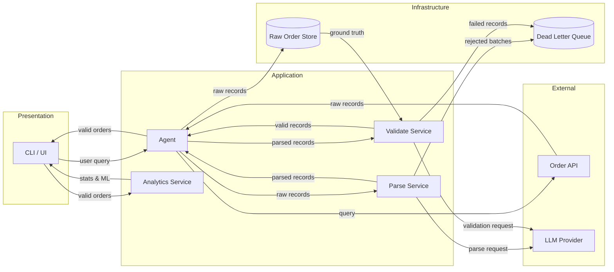
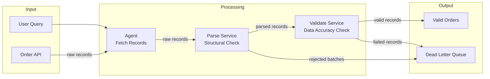
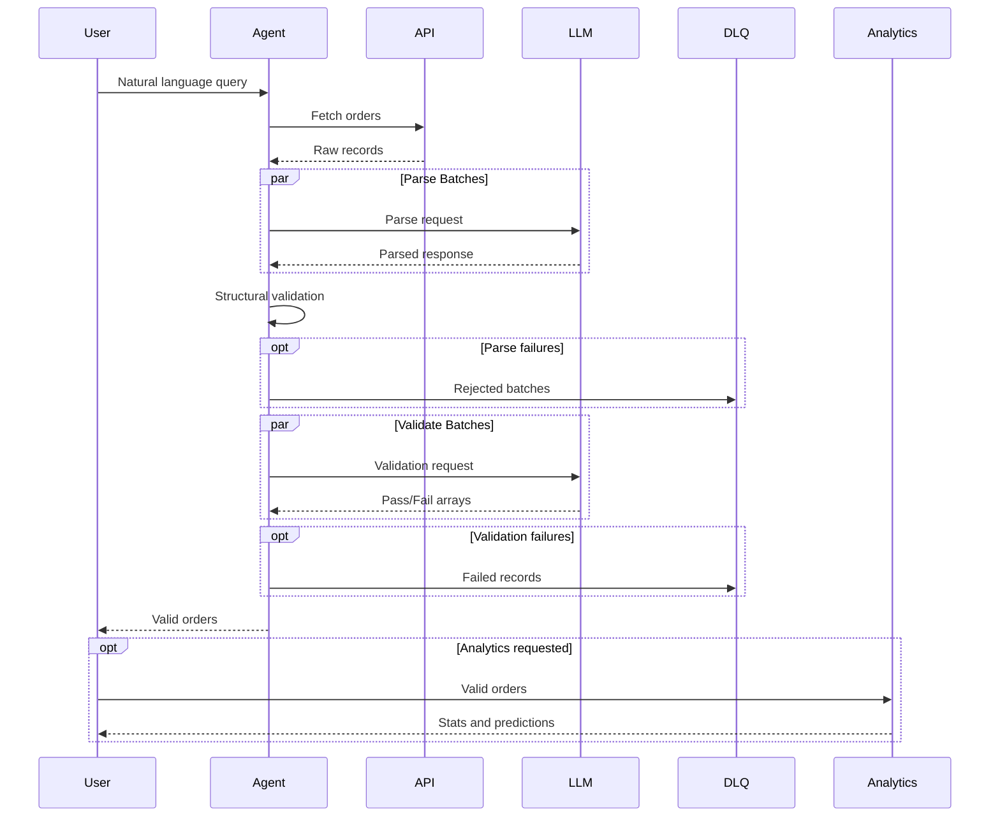

# Raft Challenge - LLM Parsing

## Component Diagram



## Data Flow



## Sequence Diagrams



---

## Project Structure Summary

---

### `config.py`

**Purpose:** Centralized configuration management. Loads environment variables and provides validated settings to all modules.

| Item | Type | Description |
|------|------|-------------|
| `PROVIDER` | var | LLM provider (openrouter/ollama) |
| `LLM_MODEL` | var | Model identifier |
| `LLM_BASE_URL` | var | API endpoint |
| `LLM_API_KEY` | var | Authentication key |
| `LLM_TEMPERATURE` | var | Sampling temperature |
| `MAX_TOKENS` | var | Max output tokens per call |
| `CHUNK_SIZE` | var | Orders per batch |
| `PARSE_CONCURRENCY` | var | Max concurrent parse calls |
| `VALIDATE_CONCURRENCY` | var | Max concurrent validation calls |
| `MAX_RETRIES` | var | Retry attempts for failed batches |
| `DUMMY_API_URL` | var | Order API endpoint |

**Dependencies:** `os`, `dotenv`

**Dependents:** All other modules

---

### `prompts.py`

**Purpose:** Stores all LLM prompt templates. Separates prompt content from logic for easier iteration and review.

| Item | Type | Description |
|------|------|-------------|
| `SYSTEM_PROMPT` | str | Instructions for batch order parsing |
| `SINGLE_ORDER_PROMPT` | str | Instructions for individual order retry |
| `VALIDATION_PROMPT` | str | Instructions for LLM-as-judge validation |

**Dependencies:** None

**Dependents:** `agent.py`, `validation.py`

---

### `schemas.py`

**Purpose:** Defines all Pydantic models for data validation, serialization, and type safety throughout the pipeline.

| Item | Type | Description |
|------|------|-------------|
| `OrderItem` | class | Item name and rating within an order |
| `Order` | class | Full parsed order with all fields |
| `Order.to_summary()` | method | Convert to challenge response format |
| `OrderSummary` | class | Minimal order for query response |
| `RawOrderStore` | class | Holds raw strings from API |
| `RawOrderStore.get_batch()` | method | Return batch by index |
| `RawOrderStore.find_by_snippet()` | method | Lookup for single order tab |
| `FailedBatch` | class | Parse stage failure record |
| `FailedRecord` | class | Validation stage failure record |
| `DeadLetterQueue` | class | Aggregates all failures |
| `DeadLetterQueue.add_batch_failure()` | method | Append parse failure |
| `DeadLetterQueue.add_record_failure()` | method | Append validation failure |
| `DeadLetterQueue.total_failures` | property | Count all failed orders |
| `QueryMeta` | class | Stats about query execution |
| `QueryResponse` | class | Response for CLI and Query tab |
| `AnalyticsData` | class | Response for Analytics tab |
| `AgentResult` | class | Complete agent output |
| `AgentResult.to_query_response()` | method | Format for query tab |
| `AgentResult.to_analytics_data()` | method | Format for analytics tab |
| `AgentResult.get_raw_order()` | method | Lookup for single order tab |

**Dependencies:** `pydantic`, `datetime`, `typing`

**Dependents:** `agent.py`, `validation.py`, `analytics.py`, `main.py`, `app.py`

---

### `clients.py`

**Purpose:** Handles external service communication. Provides async HTTP client for the Order API and factory for async LLM client.

| Item | Type | Description |
|------|------|-------------|
| `APIError` | exception | Custom exception for API failures |
| `fetch_orders_async()` | function | Async GET to dummy API, returns raw order strings |
| `get_async_llm()` | function | Factory for async LangChain LLM client |

**Dependencies:** `httpx`, `asyncio`, `langchain_openai`, `config`

**Dependents:** `agent.py`

---

### `validation.py`

**Purpose:** Provides both structural validation (JSON parsing, Pydantic) and semantic validation (LLM-as-judge) for parsed orders.

| Item | Type | Description |
|------|------|-------------|
| `parse_json_response()` | function | Extract JSON from LLM response, handle markdown fences |
| `validate_schema()` | function | Validate dict against Pydantic Order model |
| `check_batch_completeness()` | function | Verify output count matches input count |
| `validate_batch()` | async function | Send raw + parsed to LLM for semantic validation |
| `parse_validation_response()` | function | Parse LLM judge response into valid/invalid lists |

**Dependencies:** `json`, `asyncio`, `re`, `langchain_openai`, `prompts`, `schemas`

**Dependents:** `agent.py`

---

### `agent.py`

**Purpose:** Core orchestration module. Defines LangGraph state machine, async nodes for fetch/parse/validate, and public API for running queries.

| Item | Type | Description |
|------|------|-------------|
| `AgentState` | TypedDict | State flowing through LangGraph |
| `parse_batch()` | async function | Parse one batch of raw orders via LLM |
| `parse_single_order()` | async function | Parse one order for retry fallback |
| `fetch_node()` | async function | Fetch raw orders, populate RawOrderStore |
| `parse_node()` | async function | Orchestrate parallel batch parsing with retry |
| `validate_node()` | async function | Orchestrate parallel LLM-as-judge validation |
| `build_graph()` | function | Construct LangGraph StateGraph |
| `run_agent_async()` | async function | Execute graph, return AgentResult |
| `run_agent()` | function | Sync wrapper for CLI compatibility |

**Dependencies:** `asyncio`, `typing`, `langgraph`, `config`, `prompts`, `schemas`, `clients`, `validation`

**Dependents:** `main.py`, `app.py`

---

### `analytics.py`

**Purpose:** Statistical analysis and machine learning on validated order data. Independent of agent pipeline.

| Item | Type | Description |
|------|------|-------------|
| `compute_summary_stats()` | function | Calculate total orders, revenue, return rate |
| `prepare_features()` | function | Extract avg_rating, total, item_count for ML |
| `train_return_model()` | function | Fit logistic regression on order features |
| `predict_return()` | function | Predict return probability for given features |

**Dependencies:** `pandas`, `sklearn`, `schemas`

**Dependents:** `app.py`

---

### `utils.py`

**Purpose:** Cross-cutting utilities. Provides logging configuration used by entry points.

| Item | Type | Description |
|------|------|-------------|
| `setup_logging()` | function | Configure console and file logging handlers |

**Dependencies:** `logging`

**Dependents:** `main.py`, `app.py`

---

### `main.py`

**Purpose:** CLI entry point. Parses arguments, runs agent, outputs JSON to stdout.

| Item | Type | Description |
|------|------|-------------|
| `main()` | function | Parse CLI args, call agent, print result |

**Dependencies:** `sys`, `json`, `argparse`, `utils`, `agent`

**Dependents:** None (entry point)

---

### `app.py`

**Purpose:** Streamlit web UI. Provides tabs for query, single order lookup, analytics, and DLQ viewer.

| Item | Type | Description |
|------|------|-------------|
| `run_query()` | function | Wrapper to call agent async from Streamlit |
| `render_query_tab()` | function | Natural language query interface |
| `render_order_tab()` | function | Single order lookup interface |
| `render_analytics_tab()` | function | Stats and ML prediction interface |
| `render_dlq_tab()` | function | Dead letter queue viewer |
| `main()` | function | Streamlit app composition |

**Dependencies:** `asyncio`, `streamlit`, `utils`, `agent`, `analytics`, `schemas`

**Dependents:** None (entry point)

---

### `dummy_customer_api.py`

**Purpose:** Flask server generating synthetic order data. Standalone service for testing.

| Item | Type | Description |
|------|------|-------------|
| `generate_orders()` | function | Create 250 fake orders with Faker |
| `/api/orders` | route | Return raw order strings as JSON |

**Dependencies:** `flask`, `faker`

**Dependents:** None (standalone service)

---

## Dependency Graph

```plaintext
config.py ─────────────────────────────────────────────────────────┐
    │                                                              │
    ▼                                                              │
prompts.py                                                         │
    │                                                              │
    ▼                                                              │
schemas.py ◄───────────────────────────────────────────────────────┤
    │                                                              │
    ├─────────────────┬─────────────────┐                          │
    ▼                 ▼                 ▼                          │
clients.py      validation.py     analytics.py                     │
    │                 │                 │                          │
    └────────┬────────┘                 │                          │
             ▼                          │                          │
         agent.py                       │                          │
             │                          │                          │
    ┌────────┴────────┐                 │                          │
    ▼                 ▼                 │                          │
 main.py           app.py ◄─────────────┘                          │
    │                 │                                            │
    └────────┬────────┘                                            │
             ▼                                                     │
         utils.py ◄────────────────────────────────────────────────┘
```

---
