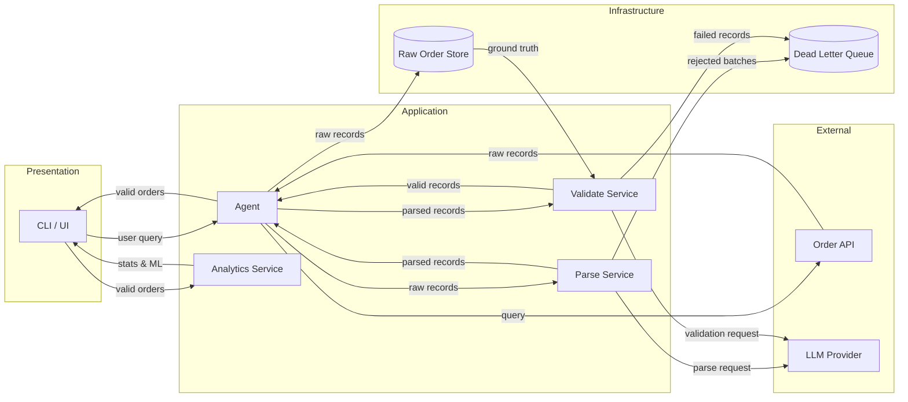
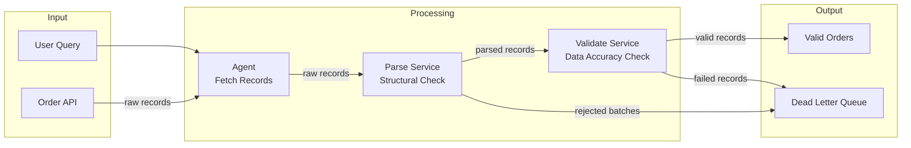
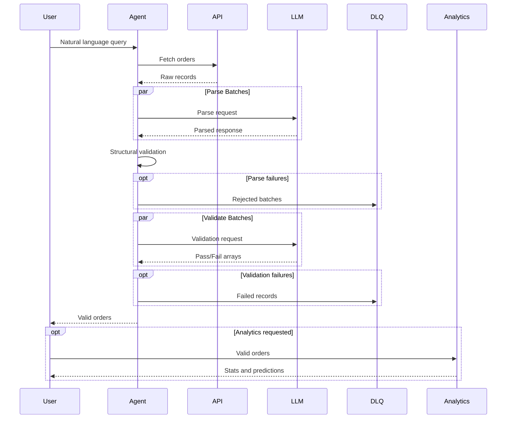

# Order Parsing Agent

An AI agent that parses unstructured order data using natural language queries with parallel processing and LLM-as-judge validation.

- [Quick Start](#quick-start)
- [Architecture](#architecture)
- [Configuration](#configuration)
- [How It Works](#how-it-works)
- [Validation](#validation)
- [Dead Letter Queue](#dead-letter-queue)
- [Analytics](#analytics)
- [Logging](#logging)

## Quick Start

### 1. Install dependencies

```bash
pip install -r requirements.txt
```

### 2. Create `.env` file

```bash
cp .env.example .env
```

Edit `.env` with your API key:

```bash
PROVIDER=openrouter
OPENROUTER_API_KEY=your_key_here
```

### 3. Start the dummy API

```bash
python dummy_customer_api.py
```

### 4. Run the agent

**CLI:**

```bash
python main.py "Show me all orders from Ohio over $500"
python main.py --full "Show me all orders"
python main.py --debug "returned orders"
```

**Streamlit UI:**

```bash
streamlit run app.py
```

## Project Structure

```
order_parsing_agent/
├── config.py               # Environment configuration
├── prompts.py              # LLM prompt templates
├── schemas.py              # Pydantic models
├── clients.py              # API and LLM clients
├── validation.py           # Structural and semantic validation
├── agent.py                # LangGraph orchestration
├── analytics.py            # Stats and ML model
├── utils.py                # Logging setup
├── main.py                 # CLI entry point
├── app.py                  # Streamlit UI
├── dummy_customer_api.py   # Flask API with synthetic data
├── requirements.txt
├── .env.example
└── README.md
```

## Architecture



## Configuration

| Parameter | Default | Description |
|-----------|---------|-------------|
| `CHUNK_SIZE` | 20 | Orders per LLM batch |
| `MAX_TOKENS` | 8192 | Max output tokens per call |
| `PARSE_CONCURRENCY` | 10 | Parallel parse requests |
| `VALIDATE_CONCURRENCY` | 10 | Parallel validation requests |
| `MAX_RETRIES` | 3 | Retry attempts with exponential backoff |
| `LLM_TEMPERATURE` | 0 | Deterministic output |

### Chunk Size Tradeoffs

| Chunk Size | API Calls (250 orders) | Est. Output Tokens | Risk |
|------------|------------------------|-------------------|------|
| 10 | 25 | ~1,000–2,000 | Low |
| 20 | 13 | ~2,000–4,000 | Low |
| 25 | 10 | ~2,500–5,000 | Medium |
| 50 | 5 | ~5,000–10,000 | High truncation risk |

## How It Works

### Data Flow



### Sequence



## Validation

The agent uses two-layer validation to catch both structural errors and data accuracy issues.

| Layer | Location | Purpose |
|-------|----------|---------|
| **Structural** | `validation.py` | Pydantic validates JSON structure, types, field constraints |
| **Semantic** | `validation.py` | LLM-as-judge compares parsed values against raw source |

### LLM-as-Judge

The semantic validator sends both parsed orders and their matching raw source strings to the LLM, which verifies field accuracy:

- **mismatch**: Parsed order has incorrect field values
- **hallucinated**: Parsed order has no matching raw source

Orders that pass both validation layers are returned to the user. Failed orders are logged to the Dead Letter Queue with detailed reasons.

## Dead Letter Queue

Failed orders are captured with full context for debugging:

**Parse Failures (FailedBatch):**

- Batch index and raw order strings
- Error message and retry attempts
- Timestamp

**Validation Failures (FailedRecord):**

- Order ID or raw snippet
- Failure type (mismatch/hallucinated)
- Specific reason from LLM judge

View failures in the DLQ tab of the Streamlit UI.

## Streamlit UI

**Query Orders** — Natural language search with parallel processing


**Single Order** — Lookup raw order by ID


**Analytics** — Summary stats and return prediction model


**Dead Letter Queue** — View parse and validation failures

## Analytics

The Analytics tab provides:

- **Summary Statistics**: Total orders, revenue, return rate, average rating
- **Return Prediction Model**: Logistic regression trained on order features
- **Prediction Widget**: Input rating/total/items to predict return probability

Features used for prediction:

- `avg_rating` — Average item rating (1.0–5.0)
- `order_total` — Dollar amount
- `item_count` — Number of items

## Logging

All modules log to console and `agent.log`:

```bash
# Normal operation
python main.py "Show me all orders"

# Debug mode (verbose LLM responses)
python main.py --debug "Show me all orders"
```

Log levels:

- **INFO**: Request counts, success rates, timing
- **WARNING**: Incomplete batches, validation failures
- **ERROR**: API failures, parse errors
- **DEBUG**: Full LLM responses, individual order processing
