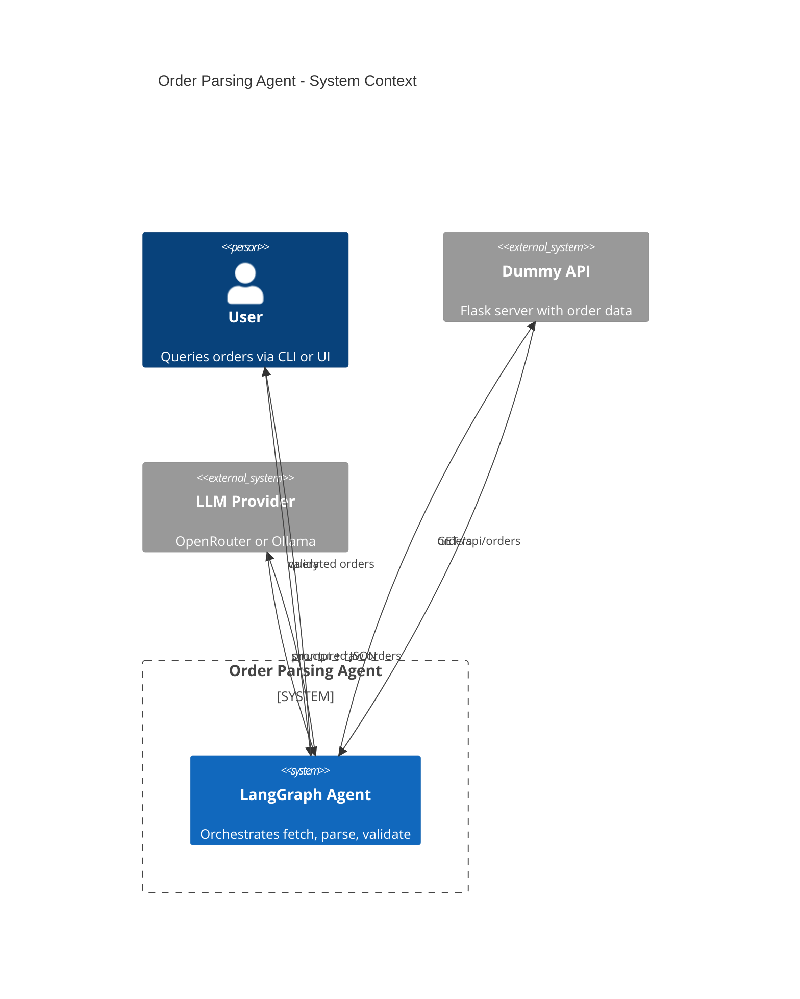
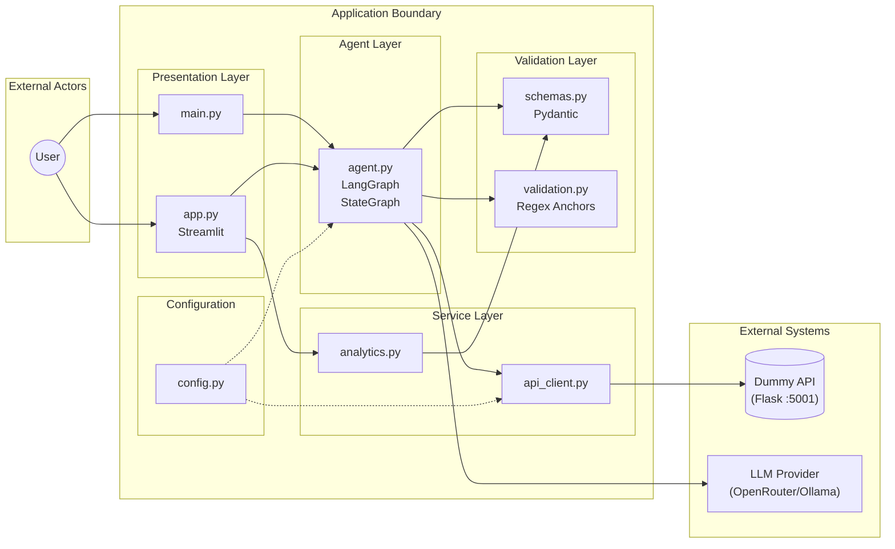
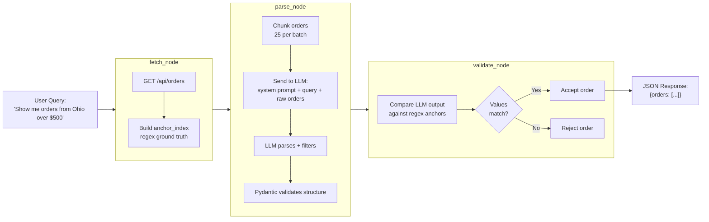
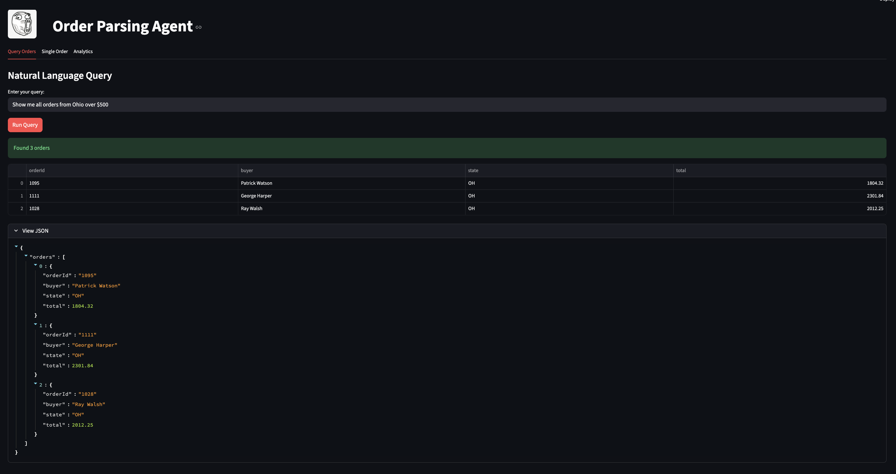
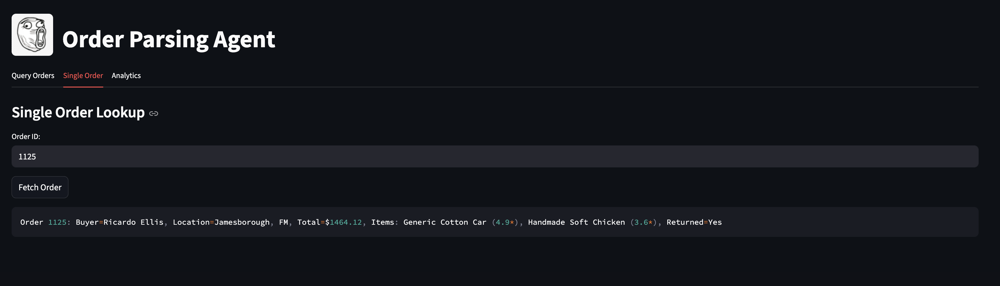
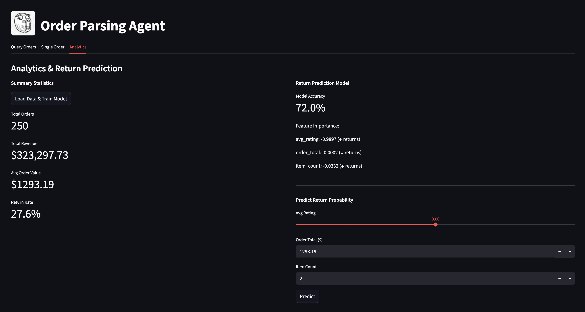

# Order Parsing Agent

An AI agent that parses unstructured order data using natural language queries.

- [Quick Start](#quick-start)
- [Architecture](#architecture)
- [Configuration](#configuration)
- [How It Works](#how-it-works)
- [Validation](#2-two-layer-validation)
- [Natural Language Queries](#3-natural-language-filtering)
- [Analytics](#analytics)
- [Edge Case Handling](#edge-case-handling)
- [Logging](#logging)
- [Future Improvements](#future-improvements)

## Quick Start

### 1. Install dependencies

```bash
pip install -r requirements.txt
```

### 2. Create `.env` file

```bash
cp env.example .env
```

Edit `.env` with your settings:

```bash
# Provider: "openrouter" or "ollama"
PROVIDER=openrouter

# OpenRouter (required for challenge submission)
OPENROUTER_API_KEY=your_key_here
OPENROUTER_MODEL=openai/gpt-oss-120b:exacto
OPENROUTER_BASE_URL=https://openrouter.ai/api/v1

# Ollama (for local testing)
# PROVIDER=ollama
# OLLAMA_MODEL=gpt-oss:20b
# OLLAMA_BASE_URL=http://localhost:11434/v1

# Tuning (see Configuration section for tradeoffs)
CHUNK_SIZE=25
MAX_TOKENS=8192

# App
DUMMY_API_URL=http://localhost:5001
```

### 3. Start the dummy API

```bash
python dummy_customer_api.py
```

### 4. Run the agent

**Option A: CLI**

```bash
python main.py "Show me all orders from Ohio over $500"
python main.py "orders where buyer is John"
python main.py  # defaults to "Show me all orders"
```

**Option B: Streamlit UI**

```bash
streamlit run app.py
```

## Project Structure

```
raft-challenge/
├── dummy_customer_api.py   # Flask API generating 250 fake orders
├── schemas.py              # Pydantic models for structural validation
├── validation.py           # Regex anchoring for factual validation
├── config.py               # Environment configuration loader
├── api_client.py           # HTTP client for dummy API
├── agent.py                # LangGraph agent with fetch/parse/validate nodes
├── analytics.py            # Summary stats + logistic regression model
├── main.py                 # CLI entry point
├── app.py                  # Streamlit UI w/ 3 tabs
├── env.example             # Environment template
├── requirements.txt        # Python dependencies
├── .gitignore              # Git ignore rules for logs, etc.
└── README.md
```

## Architecture





## Configuration

### Tuning Parameters

| Parameter | Default | Description |
|-----------|---------|-------------|
| `CHUNK_SIZE` | 25 | Orders per LLM batch |
| `MAX_TOKENS` | 8192 | Max output tokens per LLM call |
| `LLM_TEMPERATURE` | 0 | Set to 0 for deterministic output |

### Chunk Size vs. Max Tokens vs. Cost

These two parameters are directly coupled — changing one affects the viability of the other.

**Chunk size** controls how many raw orders are sent to the LLM per call. Larger chunks mean fewer API calls but more output tokens per call. If the output exceeds `MAX_TOKENS`, the JSON response is truncated mid-field, producing invalid JSON and losing the entire chunk.

**Max tokens** caps the LLM's response length. The model generates roughly 100–200 tokens per order depending on item count and formatting. At `CHUNK_SIZE=25`, expect ~2,500–5,000 output tokens per call.

| Chunk Size | API Calls (250 orders) | Est. Output Tokens | Fits in 8192? | Approx. Cost |
|------------|----------------------|-------------------|---------------|-------------|
| 10 | 25 | ~1,000–2,000 | Comfortably | ~$0.03 |
| 25 | 10 | ~2,500–5,000 | Yes | ~$0.02 |
| 50 | 5 | ~5,000–10,000 | Risky | ~$0.02 |

The system prompt requests compact JSON formatting to minimize token usage. Even so, multi-item orders with long product names can inflate output unpredictably.

**Current defaults (`CHUNK_SIZE=25`, `MAX_TOKENS=8192`)** balance reliability, latency, and cost. Reduce chunk size if you observe truncation errors in `sys.log`.

## How It Works

### 1. Data Flow



### 2. Data Source

The dummy API (`dummy_customer_api.py`) was extended to support a logistic regression use case. It now generates 250 synthetic orders using Python's Faker library. Each order includes a buyer name, city/state location, total ($9.99–$999.99 per item, 1–4 items per order), product names with star ratings (1.0–5.0), and a return status.

Return probability is correlated with average rating using a linear formula (`return_prob = 0.50 - (avg_rating - 1.0) * 0.1125`) where low-rated orders (1.0★) have a 50% return chance while high-rated orders (5.0★) have only 5%. This simulated relationship provides a learnable signal to demonstrate the logistic regression model in the analytics module.

### 3. Two-Layer Validation

| Layer | Location | Purpose |
|-------|----------|---------|
| **Structural** | `schemas.py` | Pydantic validates types, field constraints |
| **Factual** | `validation.py` | Regex anchors verify LLM output matches source data |

This catches both malformed JSON and hallucinated values. Note, the use of regex anchors is a design decision to counter LLM rate limits, costs, and relative latency.

Regex is typically brittle — in a resourced environment, e.g. not rate limited or less costly, LLM-as-a-judge would be well suited for validation provided a performant model.

### 4. Natural Language Filtering

The LLM receives both the user's query and raw order data.

> "Show me all orders where the buyer was located in Ohio and total value was over 500."

```json
{
  "raw_orders": [
    "Order 1128: Buyer=Zachary White, Location=Manuelland, MD, Total=$818.47, Items: Awesome Salad (4.1*), Rubber Soap (1.2*), Returned=Yes",
    "Order 1008: Buyer=Jennifer Jones, Location=Jasonfort, MO, Total=$1059.09, Items: Pizza (4.7*), Plastic Pants (1.7*), Soft Chips (2.5*), Returned=No"
  ],
  "status": "ok"
}
```

The system prompt instructs it to:

1. Parse the unstructured text into JSON
2. Apply the query as a filter (e.g., "from Ohio" → `state == "OH"`)
3. Return only matching orders

### Streamlit UI

**Query Orders** — Natural language search with table + JSON output



**Single Order** — Lookup by order ID



**Analytics** — Train model, view stats, predict returns.

### Analytics

The Analytics tab provides:

- **Summary Statistics**: Total orders, revenue, return rate
- **Return Prediction Model**: Logistic regression trained on order features
- **Prediction Widget**: Enter rating/total/item count → get return probability

Features used for prediction:
- `avg_rating` (average item rating)
- `order_total` (dollar amount)
- `item_count` (number of items)



## Edge Case Handling

| Edge Case | Strategy |
|-----------|----------|
| **Context window overflow** | Orders are chunked into configurable batches (`CHUNK_SIZE`) to stay within token limits. The system prompt requests compact JSON to minimize output tokens. |
| **LLM hallucination** | Two-layer validation: Pydantic checks structure (types, field constraints), regex anchors verify values against source data. Orders that fail either check are rejected and logged. |
| **API schema changes** | System prompt instructs the LLM to infer field mappings from context rather than relying on exact field names. Validation degrades gracefully — orders without regex anchors pass through Pydantic-only validation with logged warnings. |

## Logging

All modules log to both console and `sys.log` at INFO level. Set logging to `DEBUG` for full LLM response inspection, including raw response content and validation details.

## Future Improvements

- **Parallel chunk processing**: Currently, chunks are processed sequentially — each LLM call waits for the previous one to finish. For 250 orders at `CHUNK_SIZE=25`, this means 10 serial calls at ~60–90 seconds each (~10–15 min total). Async parallel processing would reduce wall-clock time to roughly the duration of a single call (~60–90 seconds) at the same cost.

- **Truncation recovery**: This is a **design decision** that would be use case dependent. However, when the LLM response exceeds `MAX_TOKENS`, the JSON is truncated mid-field and the entire chunk is lost. A salvage mechanism could extract successfully parsed orders before the truncation point rather than discarding the full response.

- **Streaming responses**: Using streaming instead of blocking LLM calls would allow the UI to display partial results as they arrive, improving perceived latency. Considering that this is an ETL-related task, slower sequential batching is fine.

- **Caching**: Repeated queries against the same dataset re-fetch and re-parse all orders. A cache layer keyed on query + data hash would eliminate redundant LLM calls.

- **LLM-as-a-judge**: Subsequent LLM calls can be used to perform validation of both returned values and structure from the initial parsing task; constituting a multi-agent ETL design. Retry mechanisms can be implemented in parallel to ensure timely corrections. However, this approach is costly considering 3x the number of LLM calls per job.
